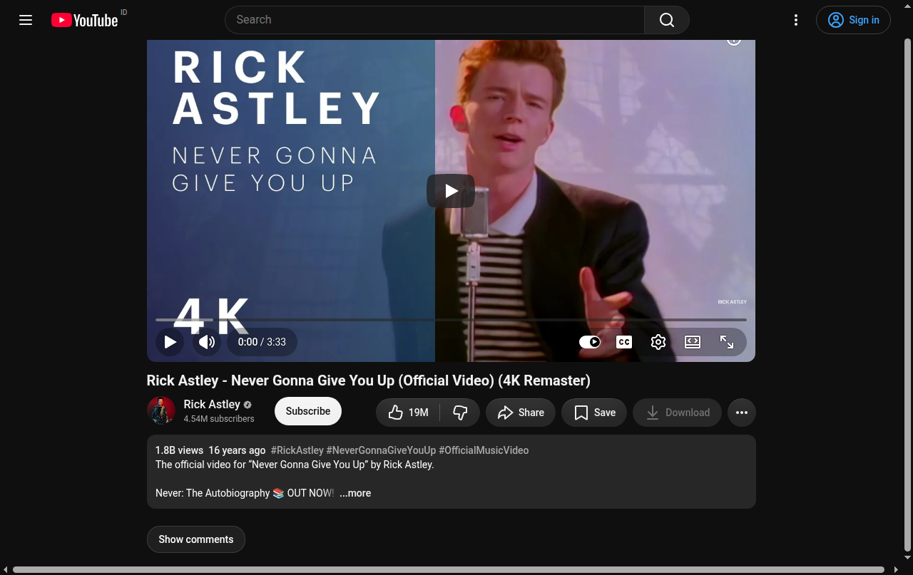

# YT Distraction Free (YT Lite)

A lightweight, distraction-free Manifest V3 Chrome extension designed to declutter YouTube, block advertising and telemetry, prevent automatic comment loading, and cut layout/GPU overhead during video playback.



---

## Why I Built This

I just wanted to watch YouTube on my potato laptop without it lagging and sounding like a jet engine.

YouTube today is heavy. It runs ambient lighting effects behind the player, preloads dozens of sidebar video previews you never asked for, and dumps thousands of comments into memory before you even scroll down.

This extension cuts all of that out. No sidebar distractions, no ambient glow, and comments only load if you actually click the button. Videos play smoothly, and my potato laptop is finally happy.

---

## Features

- **On-Demand Comments**: Comments are completely suppressed until you explicitly click **"Show comments"**. No background continuation requests (`youtubei/v1/next`) or avatars are loaded until requested.
- **Distraction-Free Centered Layout**: Suppresses the right-hand sidebar recommendation column, in-feed suggested videos, and thumbnail hover-prefetches, keeping the player cleanly centered.
- **Smart Sidebar Adaptation**: The sidebar dynamically appears when **Live Chat** or YouTube's **Ask (AI conversational panel)** / transcripts / chapters are active, and collapses back when closed.
- **Ultra-Low Playback Overhead**:
  - **Zero ongoing observers**: The `MutationObserver` disconnects immediately once the button is mounted (0 running observers, 0 timers, 0 intervals during playback).
  - **Zero GPU Ambient Glow**: Disables `.ytp-ambient-canvas`, saving laptop battery and GPU shader execution.
  - **-61% Render Tree Reduction**: Eliminates over 1,500 layout boxes from Blink's render tree, cutting style and layout recalculation time by ~26%.
- **Pure C++ Ad & Telemetry Blocking**: Uses Chrome's native Declarative Net Request (DNR) API to block third-party trackers (DoubleClick, Google Analytics, AdServices) and YouTube telemetry (`log_event`, `feedback`) with **0 JavaScript runtime cost**.
- **Long Video Focused**: YouTube Shorts remain in their native interface with default controls and comments.

---

## Installation

1. Clone or download this repository:
   ```bash
   git clone https://github.com/kaykool/yt-distraction-free.git
   ```
2. Open Google Chrome and navigate to `chrome://extensions/`.
3. Enable **Developer mode** (toggle in the top-right corner).
4. Click **Load unpacked** in the top-left corner.
5. Select the `yt-distraction-free` directory.

---

## Project Structure

```
yt-distraction-free/
├── manifest.json   # MV3 configuration & DNR ruleset definition
├── rules.json      # DeclarativeNetRequest ad & telemetry blocking rules
├── start.js        # Early document_start script (prevents comment flash)
├── comments.js     # Watch-page lifecycle & on-demand comment reveal button
├── hide.css        # Clean centered layout, ambient canvas & ad suppression
├── background.js   # One-time cleanup for legacy dynamic DNR rules
├── README.md       # Project documentation
└── LICENSE         # MIT License
```

---

## License

MIT License. See [LICENSE](LICENSE) for details.
